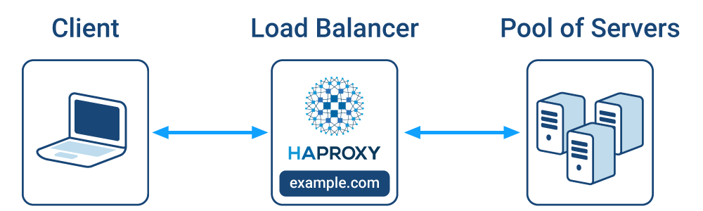
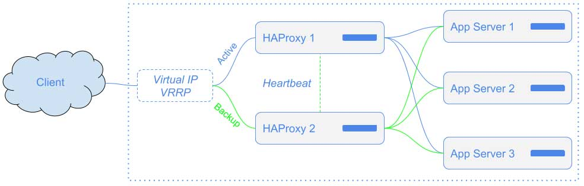

# haproxy-labs

A simple project to create an architecture with High Availability.

---


# Requirements

- [VirtualBox v7](https://www.virtualbox.org/wiki/Downloads) *(**not recommended** for M1/M2 users)*
- [VMware Fusion Player v13](https://customerconnect.vmware.com/en/evalcenter?p=fusion-player-personal-13) *(**recommended** for M1/M2 users)*
- [Vagrant v2.3.6](https://developer.hashicorp.com/vagrant/downloads?product_intent=vagrant)
- [Wireshark](https://www.wireshark.org/download.html)

---

# How does HA Proxy work?

[**HAProxy**](https://www.haproxy.org/) is a free, very fast and reliable Reverse-Proxy offering High Availability, Load Balancing, and proxying for TCP and HTTP-based applications.

---

## Diagram

|  | 
|:--:| 
| *A simple point of view on what is Load Balance* |

---

## Architecture

|  | 
|:--:| 
| *HA-Proxy + KeepAlived* |

---

## Algorithms

**HAProxy** has load balancing algorithms, below I will talk a little bit about them. So, you can define many strategies to balance your workload:

- **[Round-robin](https://en.wikipedia.org/wiki/Round-robin_scheduling)** has no validation, it just sends the same requests to each server. Perfect for stateless application. Simple to manage:
  ```
  ...
  backend back-nginxes
      balance roundrobin
      server nginx1 172.10.10.101:80
      server nginx2 172.10.10.102:80
      server nginx3 172.10.10.103:80
  ```
  - **Weight Robin:** As the name says, it's the weighted Round-robin. The node that has more weight will receive more requests.
    ```
    ...
    backend back-nginxes
        balance roundrobin
        server nginx1 172.10.10.101:80 weight 3
        server nginx2 172.10.10.102:80 weight 2
        server nginx3 172.10.10.103:80 weight 1
    ```
- **Least Connection**: Most used for long-term Layer 4 (TCP) communication, for example, a database connection.
  ```
  ...
  backend back-nginxes
      balance leastconn
      server nginx1 172.10.10.101:80
      server nginx2 172.10.10.102:80
      server nginx3 172.10.10.103:80
  ```

  - with weight:
    ```
    ...
    backend back-nginxes
        balance roundrobin
        server nginx1 172.10.10.101:80 weight 5
        server nginx2 172.10.10.102:80 weight 3
        server nginx3 172.10.10.103:80 weight 1
    ```
- **Hash URI**: Ideal for load balancing caching servers such as Squid.
  ```
  ...
  backend back-nginxes
      balance uri
      server nginx1 172.10.10.101:80
      server nginx2 172.10.10.102:80
      server nginx3 172.10.10.103:80
  ```
- **First Available**: Not very interesting, but it makes the list. Basically, you can define a maximum number of connections (maxconn) for the first server and when it overflows, the requests would be directed to the others.
  ```
  ...
  backend back-nginxes
      balance first
      server nginx1 172.10.10.101:80 maxconn 2
      server nginx2 172.10.10.102:80 maxconn 2
      server nginx3 172.10.10.103:80 maxconn 5
  ```

---
# How to setup the Virtual Machines

1. First of all, choose your favorite provider according to the recommendation above.
1. If the choice was VirtualBox, you need to make sure that you have a **private network** on VirtualBox. For that, just do:
   1. Open the VirtualBox and go to: **File > Tools > Network Manager > Host-only Networks**
1. However, here we will be using **VMWare Fusion Player**. For that, just do:
   ```shell
   make setup
   make up-nginx
   make up-haproxy
   ```

   StdOut:
   ```shell
   ...
   ==> ubuntu-nginx-3: Running provisioner: shell...
       ubuntu-nginx-3: Running: inline script
       ubuntu-nginx-3: INSTALLER: Installation complete and ready to use!
   ```

1. Test the connection to verify that everything is OK:
   ```shell
   make test
   ```

   StdOut:
   ```shell
   > make test
   ansible all -m ping -o
   172.10.10.103 | SUCCESS => {"ansible_facts": {"discovered_interpreter_python": "/usr/bin/python3"},"changed": false,"ping": "pong"}
   172.10.10.102 | SUCCESS => {"ansible_facts": {"discovered_interpreter_python": "/usr/bin/python3"},"changed": false,"ping": "pong"}
   172.10.10.101 | SUCCESS => {"ansible_facts": {"discovered_interpreter_python": "/usr/bin/python3"},"changed": false,"ping": "pong"}
   172.10.10.201 | SUCCESS => {"ansible_facts": {"discovered_interpreter_python": "/usr/bin/python3"},"changed": false,"ping": "pong"}
   172.10.10.202 | SUCCESS => {"ansible_facts": {"discovered_interpreter_python": "/usr/bin/python3"},"changed": false,"ping": "pong"}
   ```

---

# How to setup HA Proxy

You can customize your [**haproxy.cfg**](vagrantfiles/haproxy/haproxy.cfg) using filtering rules, redirection, etc.

Let's see some examples below.

---

## ACL

ACL is used for decision-making, it uses conditionals to return **TRUE** or **FALSE** and based on the result of ACL, we can make a decision.

You can check the [**ACL documentation**](https://cbonte.github.io/haproxy-dconv/2.3/configuration.html#7) written by HAProxy team.

### Usage Examples

- Declaration:
  ```
  acl is_private_network src 172.10.10.0/24
  ```
- Explanation:
  | Declare | ACL name           | Method (fetching sample) | Compare values |
  | ------- | ------------------ | ------------------------ | -------------- |
  | acl     | is_private_network | src                      | 172.10.10.0/24 |
### Use Cases

- PATH

  | Line | Explanation |
  | ---- | ----------- |
  | `acl is_post_jan path -i /posts/janeiro/15` | Compare if the full `path` is `/posts/janeiro/15` |
  | `acl is_post path_beg -i /posts` | Compare if the starting path is `/posts` |
  | `acl is_post_subdir path_dir -i /posts` | Compare if it is a subdirectory of path with `/something/posts/january` |
  | `acl is_image path_end -i .jpg .png` | Compare if the path ends with `/blabla.jpg` |
  | `acl is_4_digit path_len 4` | If the number of digits in the path is equal to 4 |
  | `acl is_gt_4 path_len gt 4` | If the number of difits in the path is greater than 4 |
  | `acl is_image_regex pathreg (png|jpg|jpeg|gif)$` | Just using RegEx |
  | `acl is_substring path_sub -i posts` | If contains a string as `posts` |

- PARAMETER
  | Line | Explanation |
  | ---- | ----------- |
  | `acl is_region_rj url_param(region) -i -m str rio rj` | Compare if the Region parameter exists with value "rio" |

- HEADER
  | Line | Explanation |
  | ---- | ----------- |
  | `acl is_header_region_rj req.hdr(Region) -i -m str rio rj` | Compare if the Region header exists with value "rio" |
  | `acl is_my_old_domain req.hdr(Host) -i -m str old.domain.net` | Compare if the request with Host header is equals "old.domain.net" |

---

## Control-Cache

If the application doesn't have a shared **Session management** using Redis or MemCached for example, we end up being dependent on the session **Stickiness** feature.

### Cookies

With **Cookies** it's possible to keep the client session for a backend for a while (until the session lasts).

#### Usage Example:

```ini
defaults
    option redispatch

...
backend back-nginxes
    cookie BACKENDUSED insert indirect nocache
    option httpchk HEAD /
    server nginx1 172.10.10.101:80 check cookie nginx1
    server nginx2 172.10.10.102:80 check cookie nginx2
    server nginx3 172.10.10.103:80 check cookie nginx3

```

### Stick Tables

**Sticky Session** works great in L7 load balancing, however if you want to assign a client on a server using L4 load balancing, you will need to use another feature as there is no cookie.

A great feature is the use of **Stick Tables**. With this it is possible to create a key-value data table. Based on this table, we can make decisions.

#### Usage Example:
```ini
...
backend back-nginxes
    option httpchk HEAD /
    server nginx1 172.10.10.101:80 check
    server nginx2 172.10.10.102:80 check
    server nginx3 172.10.10.103:80 check
    stick-table type ip size 1m expire 30m
    stick match src
    stick store-request src

```

---

## HTTPS (TLS)

You can use the [**CertBot (by Lets Encrypt)**](https://certbot.eff.org/instructions?ws=haproxy&os=ubuntufocal) and follow the steps given by them.

> Note: Change the Operation System according what you are using.

### Usage Example

```ini
...
frontend front-nginxes
    bind *:80
    bind *:443 ssl crt /etc/haproxy/certs/nginx.pem
    option forwardfor
    default_backend back-nginxes
```

Other configurations:

- To ensure requests are HTTPS, use:
  ```ini
  ...
  frontend front-nginxes
      redirect scheme https if !{ ssl_fc }
  ```
- To restrict the use of TLS versions **(ssl-min-ver / ssl-max-ver)**, use:
  ```ini
  ...
  frontend front-nginxes
      bind *:443 ssl crt /etc/ssl/certs/nginx.pem ssl-min-ver TLSv1.1 ssl-max-ver TLSv1.3
      default_backend back-nginxes
  ```
- To force the use of specific TLS version (TLS1.2), use:
  ```ini
  ...
  frontend front-nginxes
      bind *:443 ssl crt /etc/ssl/certs/nginx.pem force-tlsv12
      default_backend back-nginxes
  ```
- Global SSL rules (all backends):
  ```ini
  global
      ssl-default-bind-options ssl-min-ver TLSv1.1 ssl-max-ver TLSv1.3
  ```

---

## Security

As it is a web service, it is exposed and may be vulnerable to some attacks. With that in mind, HA-Proxy allows you to create rules to deny or block malicious requests. Below we will see some ways to avoid certain situations that can happen with your server.

Let's see techniques to improve our security with HA-Proxy.

### User List

User List allows you create a group of users to force authentication on pages.

```ini
...
userlist DevOps
   wallace.salles password <PASSWD> # usage example: openssl passwd -5

frontend front-nginxes
  bind *:80
  bind *:443 ssl crt /etc/haproxy/certs/nginx.pem

  acl is_authenticated http_auth(DevOps)
  http-request auth unless is_authenticated
```

### CHROOT

**chroot** is basically a technique to isolate the use of a certain file in a specific directory.

Let's see some usage cases (step-by-step):

- Shell
  ```shell
  sudo groupadd haproxy
  sudo useradd haproxy -g haproxy
  sudo mkdir -p /var/lib/haproxy/dev
  ```

- **/etc/haproxy/haproxy.cfg**:
  ```ini
  global
      log    /dev/log         local0
      chroot /var/lib/haproxy
      user   haproxy
      group  haproxy
  ```

- **/etc/rsyslog.d/haproxy.cfg**:
  ```ini
  $AddUnixListenSocket /var/lib/haproxy/dev/log
   
  :programname, startswith, "haproxy" { 
    /var/log/haproxy.log 
    stop 
  }
  ```

- Restarting the services:
  ```shell
  sudo systemctl restart rsyslog
  sudo systemctl restart haproxy
  ```

### TCP connection limit

It is also possible to limit the number of simultaneous connections coming from the same **IP address**, in this way, we can avoid, for example, a DDoS attack.

```ini
...
  stick-table type ip size 100k expire 30s store conn_cur 
  http-request track-sc0 src 
  acl too_many_connections src_conn_cur ge 10 
  http-request deny if too_many_connections
```

To confirm, you can run **K6** following the [tips at the end of the documentation](#troubleshooting--tip-sessions)..

### Slowloris

To prevent a malicious HTTP request from being made and getting stuck, we can use the `timeout http-request 5s` for example into default rules.

To confirm, you can run **slowloris** following the [tips at the end of the documentation](#troubleshooting--tip-sessions).

### Hardening

We will see some topics such as:
- Allow list: allows the use of traffic without rules for the Internal Network
- Block list: blocks traffic for some scenarios:
  - Access limit
  - Download limit

#### Usage Example

In the example below, let's do:

- Create a Stick-Table to store the data for 2 minutes:
   - conn_cur => numbers of current connections
   - conn_rate => averaged over the 3 second interval
   - bytes_out_rate => summed over a period of 60 seconds
   - gpc0 => created to be a counter
- Create an ACL that:
   - allows traffic from the internal network with CIDR 172.10.10.0/24
   - checks if the number of TCP connections from the same IP address is greater than or equal to 10
   - checks if the average number of TCP connections from the same IP address is greater than or equal to 60
   - checks if the network traffic source is greater than 10mb (10485760 bytes)

If any of the ACL rules are true (*with the exception of the internal network*), the source IP address will be banned for 2 minutes (*according to the Stick-Table storage time*).

- **/etc/haproxy/haproxy.cfg**:
  ```ini
  ...
  frontend front-nginxes
      bind *:80
      bind *:443 ssl crt /etc/haproxy/certs/nginx.pem
      option forwardfor
      stick-table type ip size 100k expire 2m store conn_cur,conn_rate(3s),bytes_out_rate(60s),gpc0
      acl is_internal_network src 172.10.10.0/24
      acl too_many_tcp_conn src_conn_cur ge 10
      acl too_many_conn src_conn_rate ge 60
      acl is_download_limit src_bytes_out_rate gt 10485760
      acl flag_as_abuser sc0_inc_gpc0 gt 0
      acl is_abuser src_get_gpc0 gt 0
      http-request track-sc0 src
      http-request allow if is_internal_network
      http-request silent-drop if is_abuser
      http-request deny if too_many_tcp_conn flag_as_abuser
      http-request deny if too_many_conn flag_as_abuser
      http-request deny if is_download_limit flag_as_abuser
      
      redirect scheme https if !{ ssl_fc }
      default_backend all-nginxes
  ```

---

## HA-Proxy via Socket

We can make requests to our HA-Proxy via Socket. The advantages for example, is that we can modify the HA-Proxy behavior without needing to restart the process/service, we can show the Stick-Table data and so on.

- **/etc/haproxy/haproxy.cfg**:
  ```ini
  global
      stats socket /var/lib/haproxy/stats level admin
      ...
  ```

- Shell (*we need to install:* **socat**):
  ```shell
  sudo systemctl restart haproxy
  sudo yum install socat -y
  ```

- Some useful commands:
  ```shell
  $ echo "help" | sudo socat stdio /var/lib/haproxy/stats
  $ echo "show info" | sudo socat stdio /var/lib/haproxy/stats
  $ echo "enable server back-nginxes/nginx2" | sudo socat stdio /var/lib/haproxy/stats
  $ echo "set server back-nginxes/nginx2 state maint" | sudo socat stdio /var/lib/haproxy/stats
  $ echo "set server back-nginxes/nginx2 state ready" | sudo socat stdio /var/lib/haproxy/stats
  $ echo "set weight back-nginxes/nginx1 200" | sudo socat stdio /var/lib/haproxy/stats
  $ echo "get weight back-nginxes/nginx1" | sudo socat stdio /var/lib/haproxy/stats
  $ echo "show table" | sudo socat stdio /var/lib/haproxy/stats
  $ echo "show table front-nginxes" | sudo socat stdio /var/lib/haproxy/stats
  $ echo "clear table front-nginxes" | sudo socat stdio /var/lib/haproxy/stats
  $ echo "clear table front-nginxes key 172.10.10.201" | sudo socat stdio /var/lib/haproxy/stats
  ```

---

## How to setup KeepAlived

You can customize your [**keepalived.conf**](vagrantfiles/haproxy/keepalived_master.conf) if you want.

Let's see the default configuration:

- Usage Example:
  ```ini
  vrrp_instance VRRP1 {
      state MASTER
      interface eth1
      virtual_router_id 41
      priority 200
      advert_int 1
      virtual_ipaddress {
          10.0.0.100/24
      }
  }
  ```

- Explanation:
  | key               | description                 |
  | :---------------: | --------------------------- |
  | vrrp_instance     | (requires) Starts a virtual IP configuration |
  | state             | (optional) MASTER or BACKUP |
  | interface         | (requires) Which network interface will you do "advertising" |
  | virtual_router_id | (requires) Configuration ID from 0 to 255 to identify which "group" |
  | priority          | (requires) Value that defines who will be the master. E.g: 50,100,150,200 |
  | advert_int        | (requires) How many seconds an advertising package will be sent on the network |
  | virtual_ipaddress | (requires) Virtual IP that will be created along with the netmask |

---

# Troubleshooting & Tip Sessions

1. If you are not using Apple M1/M2, you need to change to another AMD64 BOX for example.
   1. You can use [Vagrant Cloud](https://app.vagrantup.com/boxes/search) to search the boxes according to your provider (vmware, virtualbox, etc).
1. DHCP:
   1. To release the current IP address: `dhclient -r`
   1. To obtain a fresh lease: `dhclient`
1. Testing the SSL connections:
   ```shell
   openssl s_client -tls1_1 -connect <ip>:<port> -debug -msg
   ```
1. Generate encrypted password based on SHA256:
   ```shell
   openssl passwd -5
   ```
1. Simulate 10 simultaneous connections using [**k6.js script**](k6.js):
   ```shell
   k6 run --vus 10 --duration 10s -e BASE_URL=<YOUR_URL> k6.js
   ```
1. Simulate a [**Slowloris Attack**](https://github.com/gkbrk/slowloris) to stuck 20 connections and refresh for 5 seconds:
   ```shell
   pip install slowloris
   slowloris <ip> --port <port> -s 20 --sleeptime 5 -v
   ```
